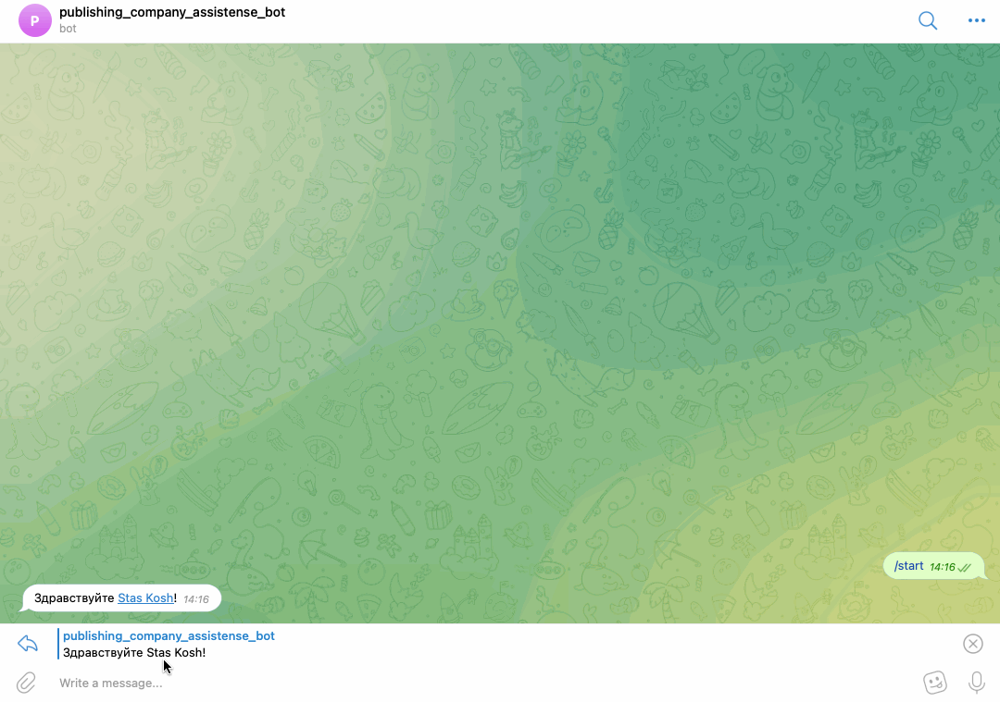

# Бот-помощник для компаний.
Данные скрипты позволяет помочь сотрудникам отвечать на типовые запросы клиентов в ВК и Телеграм.
Попробовать можно в [ВК](https://vk.com/im?sel=-210042253) и [Телеграм](https://t.me/publishing_assistense_bot)
Ну или посмотреть демо: 
### Как установить
- [Python3](https://www.python.org/downloads/) должен быть уже установлен. 
- Установить [виртуальное окружение](https://python-scripts.com/virtualenv).
  
1. Настройки для бота ВК.
- Создайте [группу вконтакте](https://vk.com/groups).
- [Получите токен](https://dvmn.org/media/filer_public/2f/11/2f11a34a-1de3-4acc-838d-d1be37bd6828/screenshot_from_2019-04-29_20-10-16.png) в настройках группы.
- Разрешите [отправку сообщений](https://dvmn.org/media/screenshot_from_2019-04-29_20-15-54.png) в настройках. 
- Запишите полученный токен в '.env' как:
```python
VK_GROUP_TOKEN='тут ваш токен'
```
- Для получения логов в телеграм запишите в '.env' ваш телеграм id.
```python
TG_LOGS_CHAT_ID='тут ваш телеграм id'
```
  
2. Настройки для бота ВК.
- Создайте Телеграм бота  и получите токен. Сделать это можно тут: [BotFather](https://telegram.me/BotFather), для этого необходимо
ввести `/start` и следовать инструкции.
- Запишите полученный токен в '.env' как:
```python
TG_TOKEN='тут ваш токен'
```  
- Запустите полученного бота при помощи команды `/start`.
- Для получения логов в телеграм запишите в '.env' ваш телеграм id.
```python
TG_LOGS_CHAT_ID='тут ваш телеграм id'
```

3. Настройки DialogFlow.
- [Cоздайте проект в DialogFlow](https://cloud.google.com/dialogflow/docs/quick/setup) и получите [идентификатор проекта](https://dvmn.org/media/project.png)
- [Cоздайте “агента”](https://cloud.google.com/dialogflow/docs/quick/build-agent)
  Обратите внимание! Идентификатор проекта из прошлого шага. Русский язык, иначе бот не будет понимать ваши фразы.
- Создать новый [Intent](https://dvmn.org/media/screenshot_from_2019-04-29_15-19-56.png). Добавить ему Training phrases и Response.
- [Создайте JSON-ключ](https://cloud.google.com/docs/authentication/getting-started).
- Добавьте полученные переменные в '.env' как:
```python
GC_PROJECT_ID='тут ID проекта'
```  
```python
LANGUAGE_CODE='тут язык проекта.Если используете русский язык, то ru-RU'
```  
```python
GOOGLE_APPLICATION_CREDENTIALS='тут путь до полученного ключа'
```
- Если вы хотите добавить тренировочные фразы и ответы в intents, воспользуйтесь скриптом ниже:
Для этого в'.env' внесите переменную
```python
FILE_URL='тут ссылка на файл с фразами и ответами.'
```
Запустите скрипт.
```bash
python3 create_intents.py
```
Пример файла [тут](https://dvmn.org/media/filer_public/a7/db/a7db66c0-1259-4dac-9726-2d1fa9c44f20/questions.json)

### Как запустить
1. Скачайте код
2. Установите зависимости командой:
```bash
pip install -r requirements.txt
```
3. Запустите скрипт:
```bash
python3 vk_publishing_bot.py
```
и/или
```bash
python3 tg_publishing_bot.py
```

### Как запустить на Хероку
1. Зарегистрируйтесь на [Хероку](https://id.heroku.com/login)
2. Cоздайте приложение (app). 
3. Привяжете аккаунт GitHub к аккаунту Heroku во вкладке Deploy и нажмите Deploy Branch.
   Если не получилось привязать аккаунт, воспользуйтесь [инструкцией для терминала](https://devcenter.heroku.com/articles/git)
4. Заполните чувствительные данные Config Vars из файла `.env` во вкладке Settings.
Обратите внимание на переменные ниже.
```python   
GOOGLE_APPLICATION_CREDENTIALS=google-credentials.json
```
```python   
GOOGLE_CREDENTIALS='тут ваши данные из файла ключа json'
```
Без этих настроек Хероку не сможет определить переменную `GOOGLE_APPLICATION_CREDENTIALS`.

5. Активируйте Dyno во вкладке Resources. 

Готово, теперь ваш бот будет работать постоянно.

## Цель проекта

Код написан в образовательных целях на онлайн-курсе для веб-разработчиков [Devman](https://dvmn.org).
